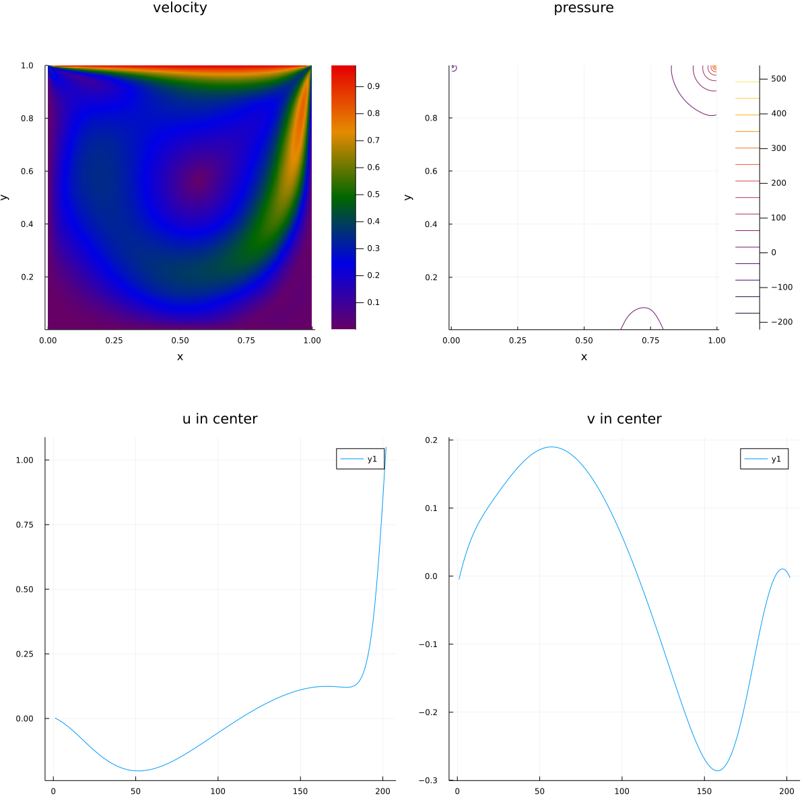

# Computational Fluid Dynamics byJulia
Juliaを用いた数値流体計算サンプル
 
## 特徴
- Juliaでの数値計算
    - 数値計算に強みを持つ`julia`([公式HP](https://julialang.org/))を利用している
    - ただ、数値流体力学(CFD)に対してはまだあまり記事が無く、日本語での記事も少なかったため、自分で実装した。

## システム要件
- 出力に`plots`パッケージを使用している

## 使い方
`main`関数内の変数を書き換えて実行する。

## Author
- Yuki Mori, 2022

## License
- このファイルはMITライセンスで公開している。
- This program and source code are distributed under the [MIT license](https://opensource.org/licenses/MIT).